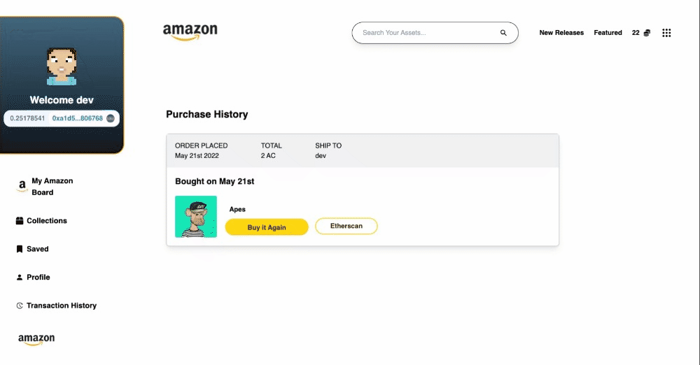

# Damazon


---


---


---



---

## Summary

This is a decentralized e-commerce website, that recreates what amazon may look like on web3. The app has the following functions:

- Purchase tokens, that follow the ERC-20 standard
- Purchase assets
- View the asset purchase history

And more..

- [Damazon](#Damazon)
  - [Summary](#summary)
- [Usage](#usage)
- [License](#license)

## Prerequisites

Please install or have installed the following:

- [nodejs and npm](https://nodejs.org/en/download/)
- [postgresql](https://postgresapp.com/)
- [hardhat](https://hardhat.org/)

# Usage

## Extra steps

1. First, complete all the ".env" variables available and install the dependencies.

```bash
   yarn
   cs smart-contract
   yarn
```

2. Deploy the smart contract on the rinkeby testnet.

```bash
   npx hardhat run scripts/deploy.js --network rinkeby
```

3. Copy the transaction id on the constants file and the ABI, from the artifacts folder to the lib folder.

4. ```bash
   cd ..
   yarn run dev
   ```

# License

This project is licensed under the [MIT license](LICENSE).
